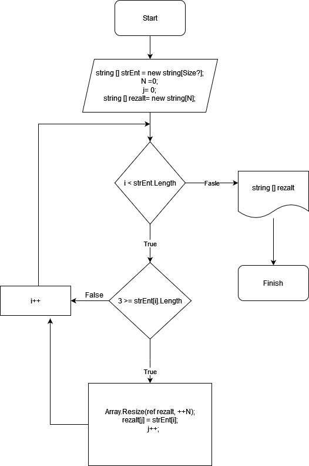

# Алгоритм работы программы:
* Вносим заполненным string массив,
* Добавляем int  N (для изменения размера нового string массива),  j (счетчик для элементов нового массива).
* Создаем новый массив для выбранных элементов. 
* Запускаем цикл длинной нашего первичного массива. Проверяем каждый элемент массива на размер по условию задачи. Если элемент соответствует  условию, расширяем наш новый массив на одно место, записываем в него элемент массива,  увеличиваем  j на 1.  
* Цикл повторяется. 
* Далее сформированный новый массив выводим на печать.  

Схема работы в картинках: 

